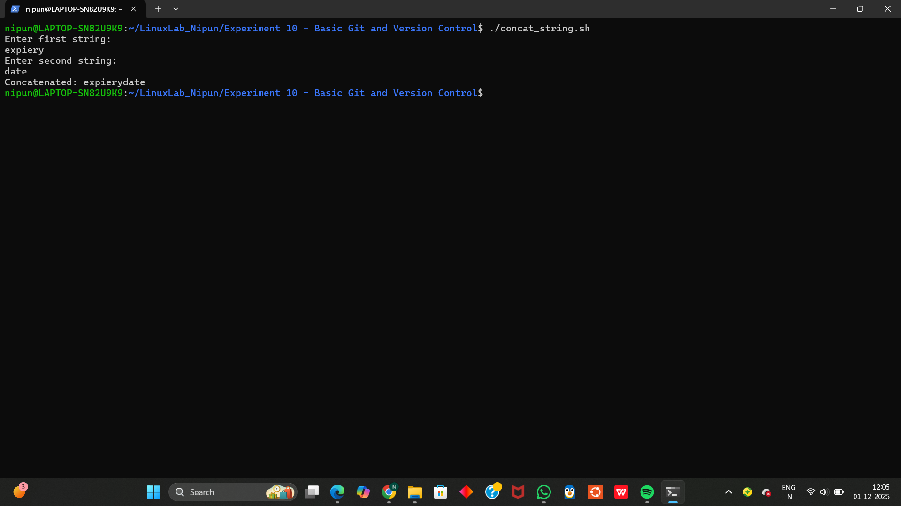

# Experiment 10 – String Handling in Shell Scripting

## Objective
To perform basic string manipulation operations in shell scripting, including:
- Finding the length of a string  
- Reversing a string  
- Concatenating two strings  

Each task is implemented as a separate shell script.

---

## Task 1 – Find Length of a String

### Script Name
string_length.sh

### Description
This script:
1. Takes a string as input from the user  
2. Uses the `${#str}` syntax to calculate the length  
3. Displays the result  

### Output Screenshot

### How to Run
chmod +x string_length.sh
./string_length.sh

---

## Task 2 – Reverse a String

### Script Name
reverse_string.sh

### Description
This script:
1. Accepts a string from the user  
2. Computes its length  
3. Uses a loop to reverse the string character-by-character  
4. Prints the reversed string  

### Output Screenshot

### How to Run
chmod +x reverse_string.sh
./reverse_string.sh

---

## Task 3 – Concatenate Two Strings

### Script Name
concat_string.sh

### Description
This script:
1. Takes two strings from the user  
2. Combines them using simple variable concatenation  
3. Prints the concatenated result  

### Output Screenshot

### How to Run
chmod +x concat_string.sh
./concat_string.sh

---

## Conclusion
This experiment introduced essential string-handling techniques in shell scripting.  
The tasks demonstrated:
- Measuring string length  
- Reversing string data manually  
- Combining multiple strings  

These operations form the foundation for advanced text processing and automation tasks in Linux shell scripting.

