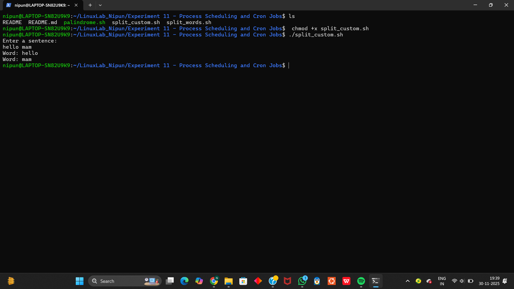
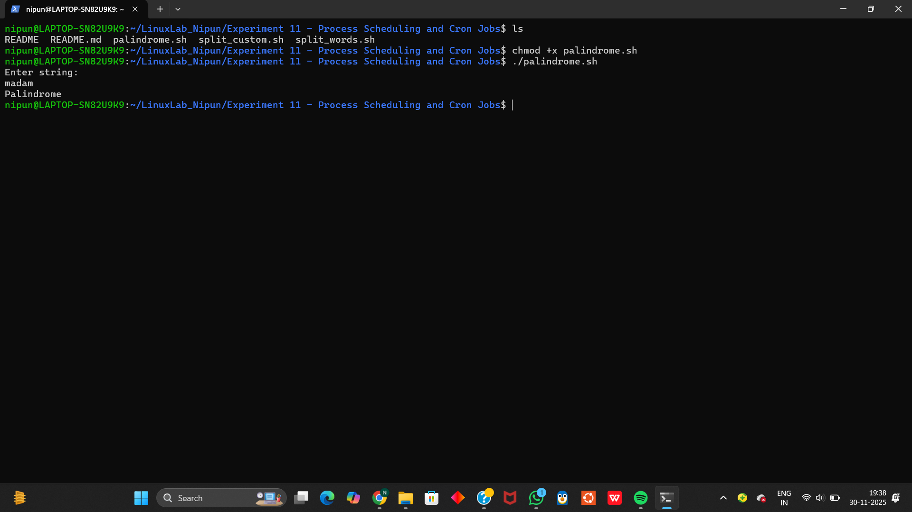

# Experiment 11 – Shell Programming (User Interaction and Database)

## Objective
To understand shell scripting techniques for interacting with users, handling text input, splitting sentences, customizing the Internal Field Separator (IFS), and validating strings such as palindrome detection.

---

## Task 1 – Split a Sentence into Words

### Script Name
split_words.sh

### Description
This script:
- Takes a sentence from the user
- Splits it using the default IFS (space, tab, newline)
- Prints each word on a separate line

### Output Screenshot

### How to Run
chmod +x split_words.sh
./split_words.sh

---

## Task 2 – Split Words Using Custom IFS

### Script Name
split_words_custom.sh

### Description
This script:
- Saves the original IFS
- Sets IFS to a single space
- Splits the user input strictly based on spaces
- Restores the original IFS after processing

### Output Screenshot

### How to Run
chmod +x split_words.sh
./split_words.sh

---

## Task 3 – Palindrome Check

### Script Name
palindrome.sh

### Description
This script:
- Reads a string from the user
- Uses the `rev` command to reverse the string
- Compares original and reversed strings
- Determines whether the string is a palindrome

### Output Screenshot

### How to Run
chmod +x palindrome.sh
./palindrome.sh

---

## Conclusion
In this experiment, the following concepts were learned:
- User input handling in shell scripts
- Default and custom Internal Field Separator (IFS)
- Word-by-word text processing
- Palindrome validation using string reversal
- Practical use of conditional statements in shell scripting

These foundational skills build the basis for more advanced shell automation and text-processing tasks.

